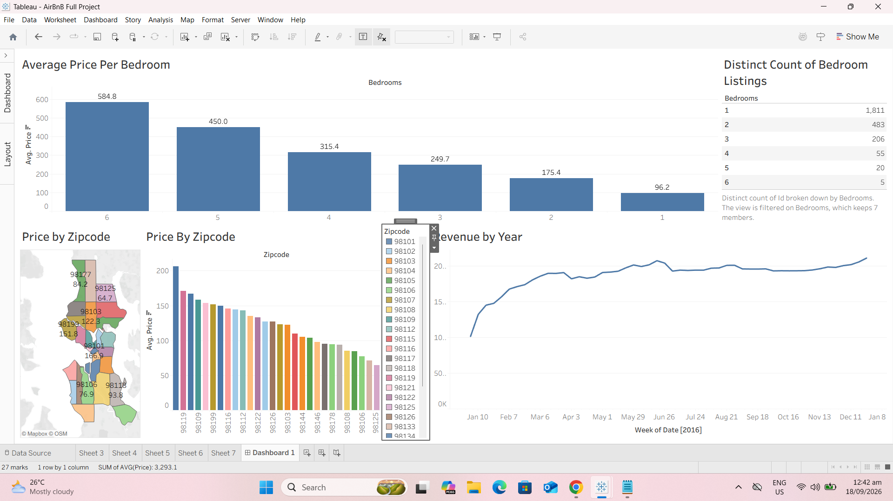

# Airbnb Data Analysis & Dashboard

A data analysis and visualization project created using Tableau to explore
Airbnb listing, pricing, availability, and review trends.

## 🛠️ Tools & Skills

- Tableau
- Data Analysis
- Data Visualization

## 📊 Project Overview

The project analyzes Airbnb listing, review, and calendar data to explore
patterns and trends related to pricing, availability, and listings.

The analysis uses interactive Tableau visualizations and dashboards to make
the data easier to explore and compare.

## 🔎 Analysis

The project explores Airbnb data across different aspects, including:

- Listing Prices
- Availability
- Reviews
- Property Listings
- Location-based Trends

## 📈 Dashboard

The Tableau dashboard provides interactive visualizations for exploring
Airbnb listing and pricing trends.

## 📁 Project Files

- **AirBnB_Data_Analysis_Dashboard.twbx** — Packaged Tableau workbook
  containing the project dashboards and data sources.
- **airbnb_dashboard.png** — Preview of the Tableau dashboard.

## 🌐 Interactive Dashboard

[View on Tableau Public](https://public.tableau.com/app/profile/quennie.justiniane/viz/AirBnBFullProject1_17896671634810/Dashboard1?publish=yes)
